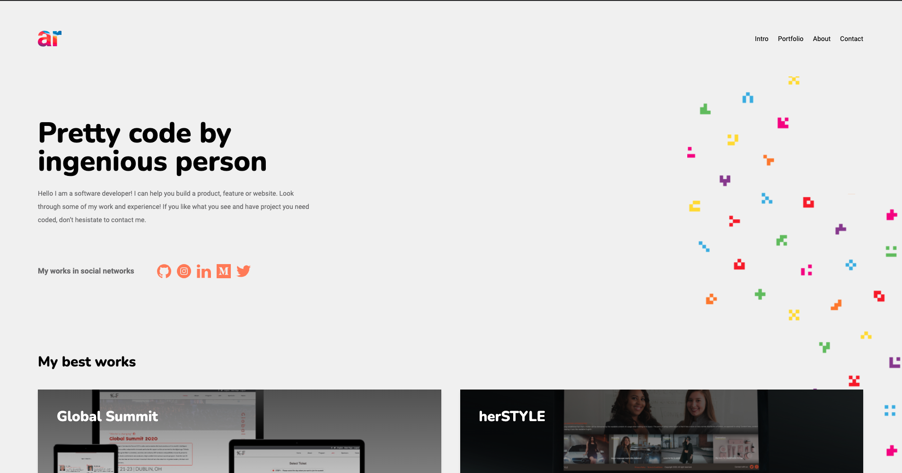
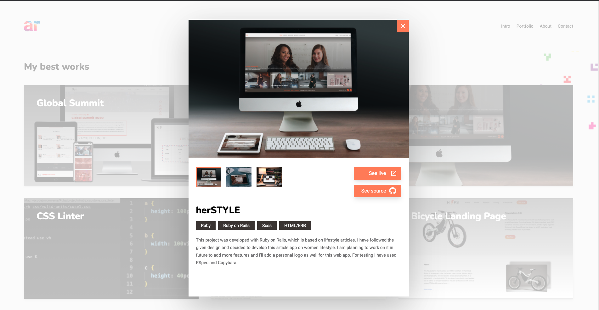

# My Portfolio

> I have created this portfolio in react and used tailwind for styling.

## Built With

- React
- Javascript
- Tailwind

## Live Demo

[amitaroy.com](https://amitaroy.com/)

## Author

👤 **Amita Roy**

- Github: [@Amita](https://github.com/Amita-Roy)
- Twitter: [@Amita](https://twitter.com/AmitaRoy14)
- Linkedin: [@Amita](https://www.linkedin.com/in/amita-roy/)

## Show your support

Give a ⭐️ if you like this project!

## Acknowledgments

> Thanks to Microverse team for providing amazing design templates for portfolio.

## 📝 License
